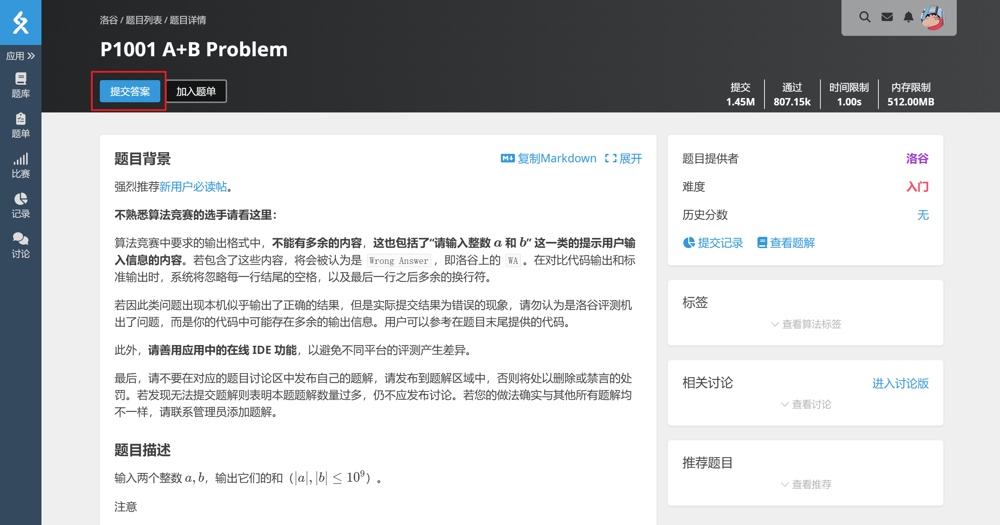
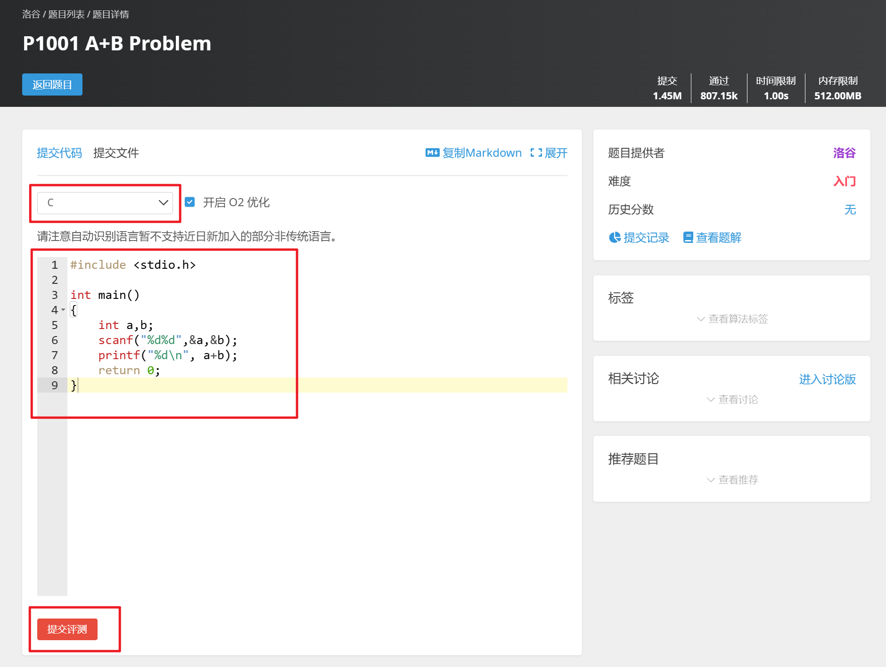

## 1.访问洛谷官网

访问 [洛谷网校](https://www.luogu.com.cn) （https://www.luogu.com.cn/），单击右上角注册按钮，**注册账号**

> **为了方便管理，建议用户名为姓名英文全拼（如：张三 的用户名为 zhangsan）**


## 2.查看题目

**成功登录后**，点击页面左侧的 [**题库**](https://www.luogu.com.cn/problem/list) 按钮，可以进行**筛选题目难度**，选择下方的题目后（如P1001），可以进入**题目详情页**查看题目。

> **考核题目的难度以洛谷题库中入门难度（红题）为主，各位新生可以有针对性的练习~**




## 3.提交答案

阅读题目后可以在题目上方点击**提交答案**，选择**正确的语言**后提交评测。



## 5.查看评测结果

提交评测后会跳转到结果页，或点击页面左侧的**记录**按钮，查看**提交记录**。


## 6.示例代码（A+B)

### C

```c
#include <stdio.h>

int main()
{
    int a,b;
    scanf("%d%d",&a,&b);
    printf("%d\n", a+b);
    return 0;
}
```

### C++

```c++
#include <iostream>
#include <cstdio>

using namespace std;

int main()
{
    int a,b;
    cin >> a >> b;
    cout << a+b << endl;
    return 0;
}
```

### Java

```java
import java.io.*;
import java.util.*;
public class Main {
    public static void main(String args[]) throws Exception {
        Scanner cin=new Scanner(System.in);
        int a = cin.nextInt(), b = cin.nextInt();
        System.out.println(a+b);
    }
}
```

