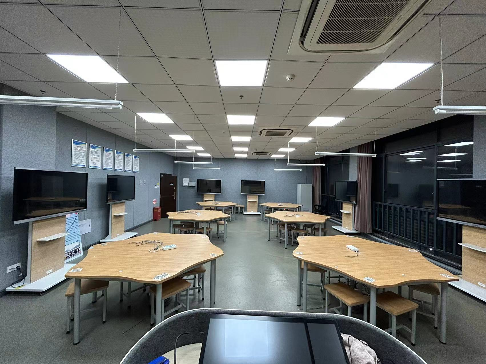

# 关于中电班

我们是计算机学院一个非常优秀的特色班级——计算机科学与技术（中电联合培养），简称“中电班”。中电班是学校与“上海中电电子系统科技股份有限公司”达成校企合作协同育人协议，共同开展物联网产业协同育人项目，本着学生自愿报名、学生与合作企业双向选择的原则，经过学院与合作企业选拔招录后成立的实体班级。

## 我们的三大优势

### 就业工作方面

- 大二暑假开始每年都可以参加企业的实习，先人一步了解企业、人才市场需求，丰富实践经验，增长实习经历
- 实习期间接受公司重点培养，优秀的同学会被优先考虑，就业压力小
- 实习与就业非强制，可自由选择

### 培养计划方面

- 专属定制的培养计划，贴近就业市场需求
- 对于想转入计算机专业的同学，直接从大一开始，紧跟培养计划，相比之后转专业进入计算机系的同学，省去了补回大一课程的烦恼和压力

### 学习资源方面

- 实验室资源：拥有2年的独立实验室，千兆网络，并拥有个人专属座位；固定的实验室，固定的自习座位，自习无需再去图书馆抢座位，也没有频繁换晚自修教室的烦恼
- 学习、讲座资源：可以免费申请学长学姐开展中电班专属的讲座
- 竞赛资源：享有学长学姐所留下来的竞赛资料，经验；根据个体实际情况和具体需求，学长学姐可以提供个性化的竞赛咨询，训练，培养，答疑服务，可以通过实验班认识更优秀的学长和学姐，可以但不仅限于提供：学术答疑、学习资料、竞赛资源、考研经验分享、生涯规划

